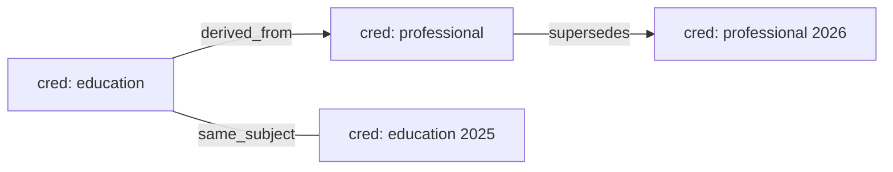

# Credential Linking — Relationship Graph and Link API

Credentials in QuorumCredit are issued and verified independently, so a holder
with a degree, the licence derived from it, and the renewed version of that
licence ends up with three unrelated rows. This document covers the linking
service that records those relationships, the rules that guard them, and the
HTTP surface that exposes them.

Implementation lives in:

| Piece | File |
| --- | --- |
| Relationship graph + validation | [`server/src/credentials/credentialLinkingService.ts`](../server/src/credentials/credentialLinkingService.ts) |
| Credentials themselves | [`server/src/credentials/credentialStore.ts`](../server/src/credentials/credentialStore.ts) |
| HTTP routes | [`server/src/http/routes.ts`](../server/src/http/routes.ts) |
| Tests | [`server/tests/credentialLinking.test.ts`](../server/tests/credentialLinking.test.ts) |

## Link types

| Type | Direction | Meaning | Extra requirement |
| --- | --- | --- | --- |
| `supports` | directional | Target provides supporting evidence for the source. | Cross-holder links need `allowCrossHolder: true`. |
| `derived_from` | directional | Source was issued on the strength of the target. | Same holder; target must not be newer than the source. |
| `supersedes` | directional | Source replaces an older credential. | Same holder; same credential type; source newer than target. |
| `same_subject` | symmetric | Both credentials attest to the same subject. | Same holder; same credential type. |
| `related` | symmetric | Generic association. | Cross-holder links need `allowCrossHolder: true`. |

Directional types are stored as `source → target`, must stay acyclic, and are
walked source-to-target when a traversal is filtered to that type. Symmetric
types are stored once in sorted order, so `(a, b)` and `(b, a)` are the same
edge.

## Validation

Every write runs through `validateLink`; a rejected link never mutates the
graph. Checks run in this order:

1. `unknown_link_type` — the type is not one of the five above.
2. `credential_not_found` — source or target is not in `credentialStore`.
3. `self_link` — a credential cannot be linked to itself.
4. `credential_revoked` — a revoked credential cannot take part in a link.
5. `duplicate_link` — the same `(source, target, type)` edge already exists.
6. `holder_mismatch` — a holder-scoped type (`derived_from`, `supersedes`,
   `same_subject`) with two different holders.
7. `cross_holder_not_acknowledged` — a `supports` / `related` link across
   holders without `allowCrossHolder: true`.
8. `type_mismatch` — `same_subject` or `supersedes` between different
   credential types.
9. `temporal_violation` — `supersedes` where the source is not newer, or
   `derived_from` where the supporting credential is newer than the derived one.
10. `cycle_detected` — the edge would close a loop between directional links.

`GET /credentials/links/stats` and `CredentialLinkingService.getStats()` report
the graph shape (total edges, per-type counts, directional vs symmetric,
credentials covered).

## HTTP API

`{id}` is the source credential. The `/api/v1` prefix is accepted exactly as
documented below, and the unversioned form (`/credentials/...`) is the same
handler — every other route in this service is unversioned, so both stay
interchangeable.

| Method | Path | Purpose |
| --- | --- | --- |
| `POST` | `/api/v1/credentials/{id}/link` | Create a link from `{id}` to `targetId`. |
| `GET` | `/api/v1/credentials/{id}/links` | List outgoing + incoming links. |
| `GET` | `/api/v1/credentials/{id}/relationship-graph?depth=2` | Traverse the graph around `{id}` (depth capped at 5). |
| `DELETE` | `/api/v1/credentials/{id}/link/{linkId}` | Remove a link touching `{id}`. |
| `GET` | `/api/v1/credentials/links/stats` | Graph-wide counters. |

### Create a link

```bash
curl -X POST "$API/api/v1/credentials/cred_12_1730000000/link" \
  -H 'content-type: application/json' \
  -d '{"targetId":"cred_11_1729990000","type":"derived_from","createdBy":"verifier-1"}'
```

`201` returns the stored edge:

```json
{
  "id": "link_1_1730000123",
  "sourceId": "cred_12_1730000000",
  "targetId": "cred_11_1729990000",
  "type": "derived_from",
  "symmetric": false,
  "createdAt": 1730000123,
  "createdBy": "verifier-1",
  "metadata": {}
}
```

A rejection carries the validation code and a human-readable reason:

```json
{ "error": "a derived_from link requires both credentials to belong to the same holder", "code": "holder_mismatch" }
```

| Code | HTTP status |
| --- | --- |
| `unknown_link_type`, `self_link` | 400 |
| `credential_not_found` | 404 |
| `duplicate_link`, `cycle_detected` | 409 |
| `credential_revoked`, `holder_mismatch`, `type_mismatch`, `temporal_violation`, `cross_holder_not_acknowledged` | 422 |

Malformed JSON or a body without `targetId` / `type` returns `400`.

### Read the relationships

```bash
curl "$API/api/v1/credentials/cred_12_1730000000/links"
curl "$API/api/v1/credentials/cred_12_1730000000/relationship-graph?depth=2"
```

`/links` returns `outgoing`, `incoming`, `total` and `linkedCredentialIds`.
The graph response returns `nodes` (with `depth` from the root),
`edges` (each edge once, `direction` relative to the credential it was reached
from) and `truncated`, which is `true` when the boundary still has neighbours
the depth limit hid.



### Remove a link

```bash
curl -X DELETE "$API/api/v1/credentials/cred_12_1730000000/link/link_1_1730000123"
```

Removal is allowed from either endpoint of the edge. A link id that does not
exist, or does not touch the credential in the path, returns `404`.
`removeLinksForCredential(id)` drops every edge touching a credential and is the
call to make when one is revoked, so the graph keeps no dangling relationships.

## Metrics

| Counter | Incremented when |
| --- | --- |
| `qc_credential_links_created_total` | A link is stored. |
| `qc_credential_links_by_type_total{type=...}` | Same, labelled per link type. |
| `qc_credential_links_rejected_total` | A write fails validation. |
| `qc_credential_links_removed_total` | A link is removed. |
| `qc_credential_link_queries_total` | `/links` is served. |
| `qc_credential_graph_queries_total` | `/relationship-graph` is served. |
| `qc_credential_link_api_rejections_total` | The API answers a rejection. |
